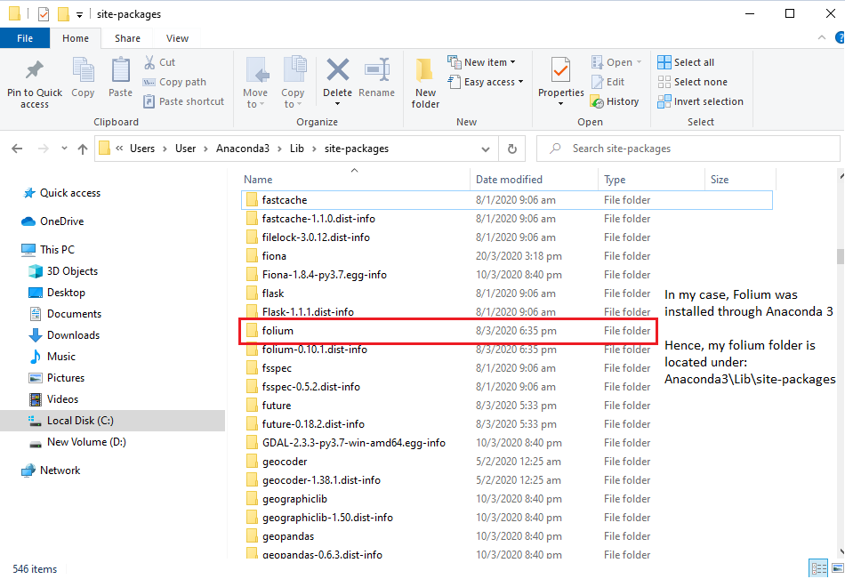

# ICT1008-PROJECT

**WELCOME TO GROUP P2-6 ICT 1008 Project**

**REQUIRED TO RUN OUR APPLICATION - UPDATE FOLIUM FILE**
1) Download this repository 

2) Download Folium
$ pip install folium 
or
$ conda install -c conda-forge folium

2) Locate the folium folder YOU had initially installed

3) Repalce your folium folder with the folium folder that you have just installed from this repository

4) If all were done correctly, there should not be any error running the application. Thanks
