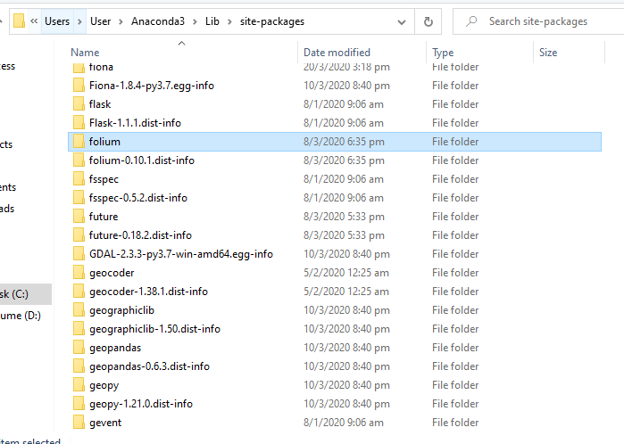
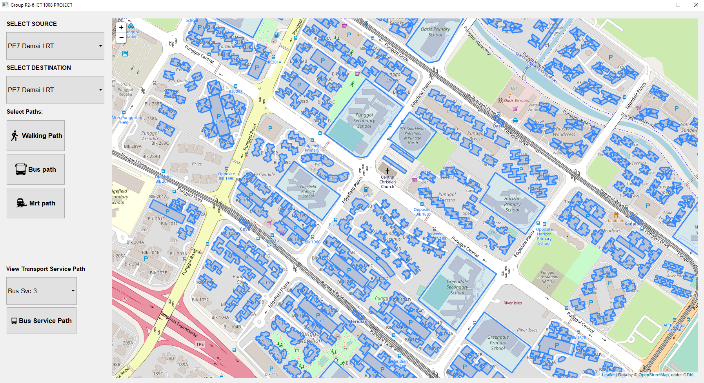

# WELCOME TO GROUP P2-6 ICT 1008 Project 

### INSTALLATION GUIDE

1) **Install PyQt (GUI)**

```
pip install PyQt5
      OR
conda install -c anaconda pyqt
```

2) **Download repository**


3) **Unzip the folder**

4) **Placed the Folium folder into your project interpreter**



**In my case, I am using anaconda as my project interpretor in PyCharm**


5) **If all libraries are installed correctly, there should not be any errors importing of folium in pyqtGUI.py**

6) **Run pyqtGUI.py**

